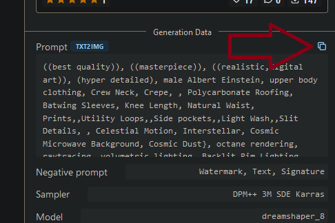

# Clipboard Watcher for Automatic1111
## Description
This will will watch your clipboard for any changes in contents. Any changes will be sent to Automatic1111 for processing. This is useful for when you want to browse Civitai and automatically send new prompts to Automatic1111 for generation.

## Installation
1. Run `npm install` to install dependencies.
2. Run `npm start` to start the script.

## Usage
You must have Automatic1111 running in the background for this to work.

You also need to configure a `.env` file. See the `.env.example` file for an example.

By default, the watcher is off. To toggle the watcher, press `w` and hit `enter` in the terminal window. 

To change the model you are using, press `o` and hit `enter` to see all of your installed models and select the one you want to use using the arrow keys. Press `enter` to select the model.

To regenerate the last prompt, press `s` and hit `enter`.

To quickly copy prompts. Open the image on Civitai and hit the "Copy prompt" button as shown.

## Limitations
This is a very simple script. It will pick up any text you copy and send it over to Automatic1111. It is also designed to not process the same prompt twice. This means that if you copy the same prompt twice, it will not be sent to Automatic1111. If you'd like to process it again, you'd have to restart the script. To generate multiple images from a single prompt, you can set the `BATCH_SIZE` variable in the `.env` file to a number greater than 1.

## Disclaimer
This is not an official product of Civitai or Automatic1111. Use at your own risk. It's also super not perfect or resilient. If anything, it's fragile. If it crashes, start it again. 